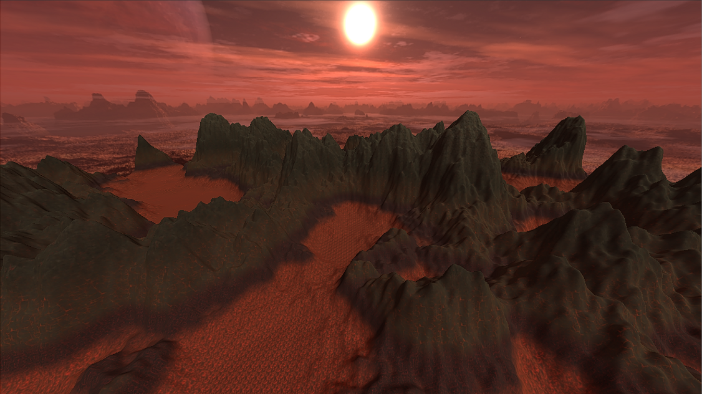
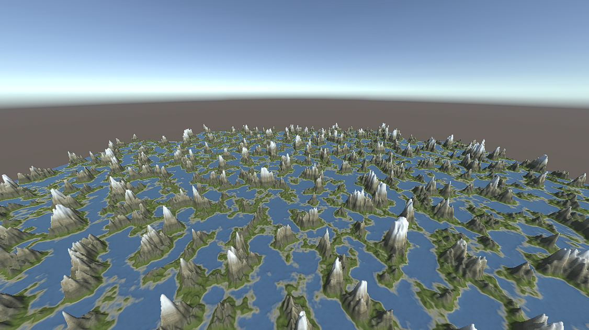
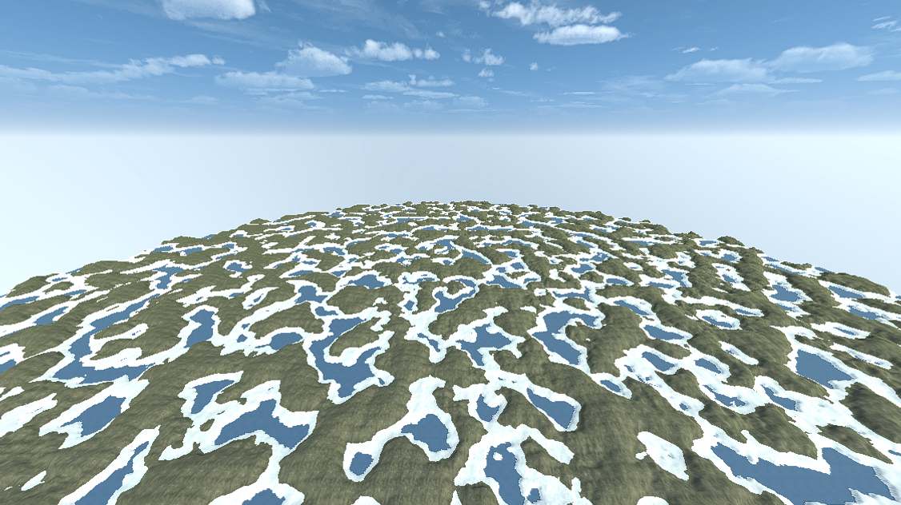
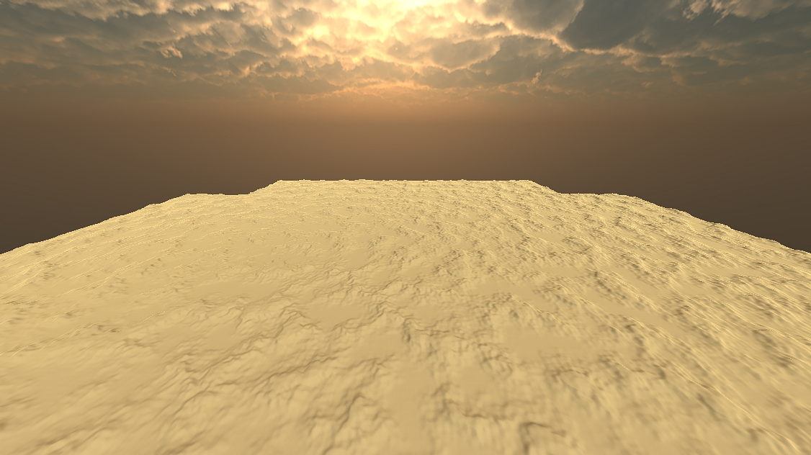
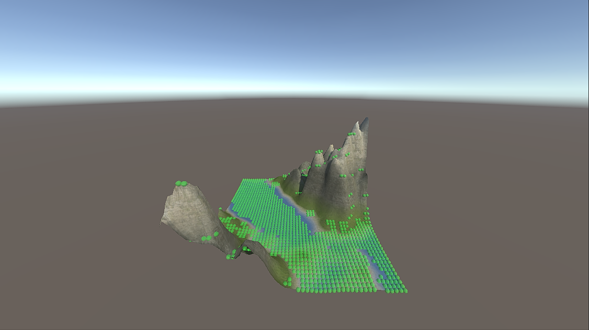
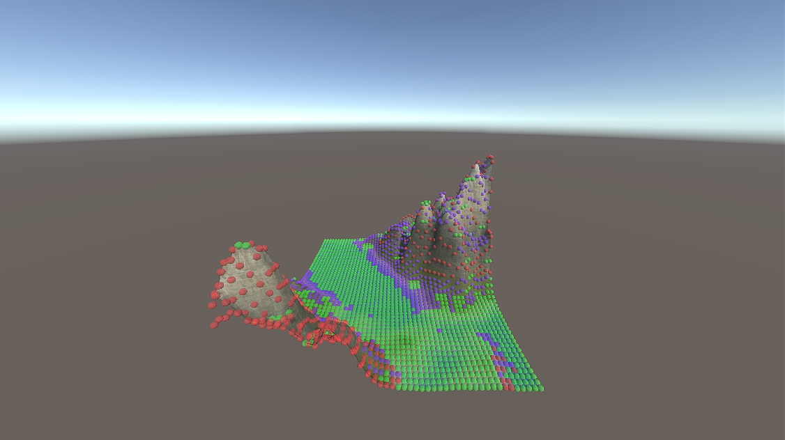
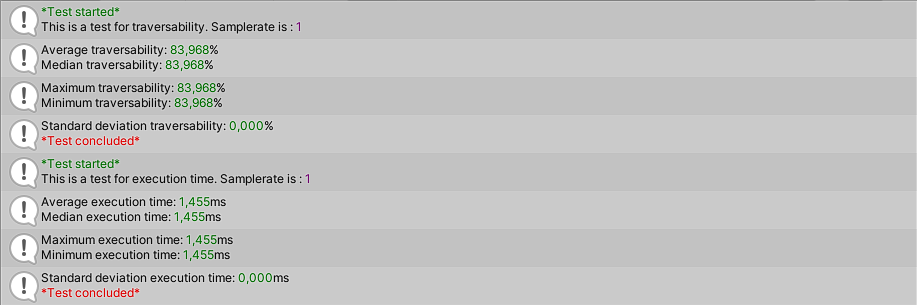

# Procedural_generation_of_terrain
This is a unityproject that procedurally generates terrain or "mountains" with a selection of algorihms.
It can also measure the traversability for a potential object to move on the terrain in a game/simulation.

***

# Results
## Terrain

 | 

 | 

***

## Traversity & tests

 | 

